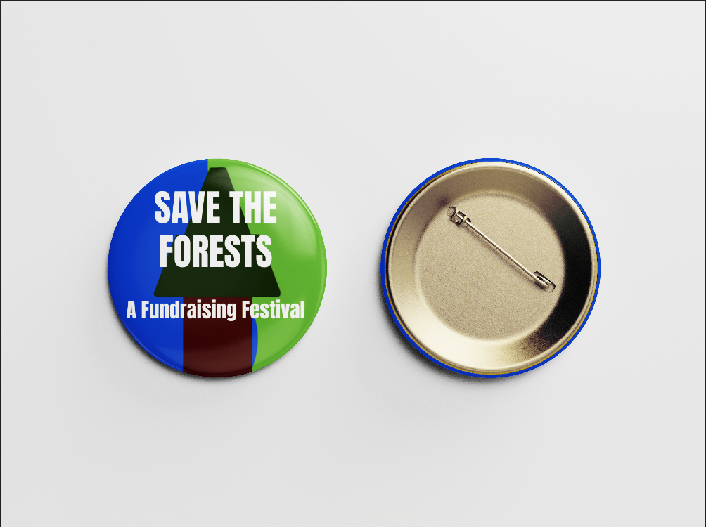

# Restore The Forests
Designed by John King  
December 15, 2024
## Project Overview

This website was created to help bring attention to forest restoration. Forests used to be under threat by companies taking wood without replanting. Many rules were put in place to prevent this action, but that did not protect the forests. Forests in California are being destroyed every year due to forest fires, and it is esential to be able to replant these forests and prevent more fires from happening. This website includes a festival in order to garner attention and achieve this goal.

The overall goal of the website is to get people to know about forest restoration, and to fundraise to help solve the problem through fun festivals and products. These festivals take place over Earth Day in California, in order to fundraise in the area that the most fires are happening, on the weekend where many people try to help the Earth. Through this website, people are able to support reforestation in order to replant and protect forests in California.

## Technical Overview
Festival Planning:  
https://github.com/JohnKingSfsu/social_justice_festival_john_king/blob/31f96a752e7bcf393d6cf5e18395238a4996d527/Project%203.pdf  
Branding Design:  
https://github.com/JohnKingSfsu/social_justice_festival_john_king/blob/31f96a752e7bcf393d6cf5e18395238a4996d527/DES228_ProjectThreeBrandGuide-2.pdf  
Figma Wireframe:  
https://www.figma.com/design/3Be5uTFU81mhqmy9YlQZqO/Project-three?node-id=0-1&m=dev&t=3R3YnU74aXFoE43W-1  

### Merch Designing:  
Artwork:  
  
Link: https://github.com/JohnKingSfsu/social_justice_festival_john_king/blob/a047937e5ae410482e8394a5beecf0bf0e5ba4ad/Resources/thumbnail_Untitled%2013-2.png

Mockup:  
  
Link: https://github.com/JohnKingSfsu/social_justice_festival_john_king/blob/a047937e5ae410482e8394a5beecf0bf0e5ba4ad/Resources/image.png

### Resources  
#### Code
Change image on hover:  
https://stackoverflow.com/questions/18032220/how-to-change-source-of-img-tag-on-hover  
Fixing image paths for css:  
https://stackoverflow.com/questions/14519388/can-i-use-an-image-from-my-local-file-system-as-background-in-html  
Fixing positioning footer:  
https://stackoverflow.com/questions/19612951/position-absolute-and-bottom-0  
Rounded images:  
https://www.w3schools.com/howto/howto_css_rounded_images.asp  
Background image:  
https://www.w3schools.com/cssref/pr_background-image.php  
Gradient:  
https://www.w3schools.com/css/css3_gradients.asp  

#### Images
Home Page:  
1: https://www.freepik.com/free-photo/aerial-view-evergreen-trees-deforest_131909501.htm#fromView=image_search_similar&page=1&position=9&uuid=0cb99bec-2299-4767-8c99-1d78ad190c61  
About Page:  
1: https://sempervirens.org/protect/  
2: https://www.google.com/url?sa=i&url=https%3A%2F%2Feos.org%2Farticles%2Fextreme-wildfires-are-getting-more-extreme-and-occurring-more-often&psig=AOvVaw1zc2XAvAcGt5Sx57K3-qNZ&ust=1733393394691000&source=images&cd=vfe&opi=89978449&ved=0CBcQjhxqFwoTCNikzOHvjYoDFQAAAAAdAAAAABAE  
Lineup:  
1: https://www.freepik.com/free-photo/beautiful-landscape-summer-carpathian-mountains_7780950.htm#fromView=image_search&page=1&position=0&uuid=c596c430-ca9b-4bff-8fb3-4dc7c78b89c0  
2: https://www.freepik.com/free-photo/close-up-male-hiker-looking-tree-branch_5223548.htm#fromView=image_search&page=1&position=0&uuid=bc9fc44d-7f12-4136-bd2a-ff22e11189d8  
3: https://www.freepik.com/free-photo/deer-with-small-horns-orange-fur-lush-greenery-forest-moldova_11175540.htm#fromView=image_search&page=1&position=0&uuid=d507c8c9-4024-481e-b500-7a20b0d8f617  
4: https://www.freepik.com/free-photo/reforestation-done-by-voluntary-group_29015470.htm#fromView=image_search&page=1&position=0&uuid=3bebd0c0-1990-4050-9420-46d3c9369de4  
5: https://www.freepik.com/free-photo/smoke-covering-mountain-medvednica_8943454.htm#fromView=search&page=2&position=20&uuid=75aa3b6e-2e8f-4e25-8df3-e6d358d90dea  